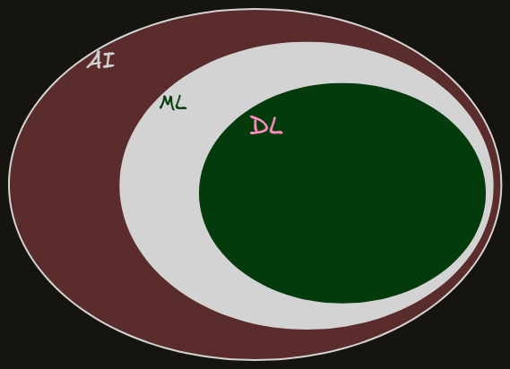

## ARTIFICIAL INTELLIGENCE
The broad science of building machines capable of mimicking human intelligence, reasoning, and problem-solving.

## MACHINE LEARNING
A subset of AI focused on algorithms that allow computers to learn from data without being explicitly programmed for every outcome.

## DEEP LEARNING
A specialized subset of ML that uses multi-layered artificial neural networks inspired by the human brain.

### Why not use DL everywhere if that is more powerful than ML?
**Ans:** Most of the data present are mostly small, very few of them are very large data and DL is mostly used on large datas only.