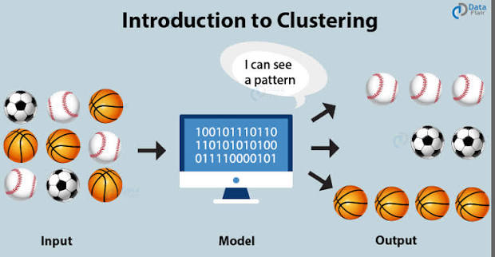
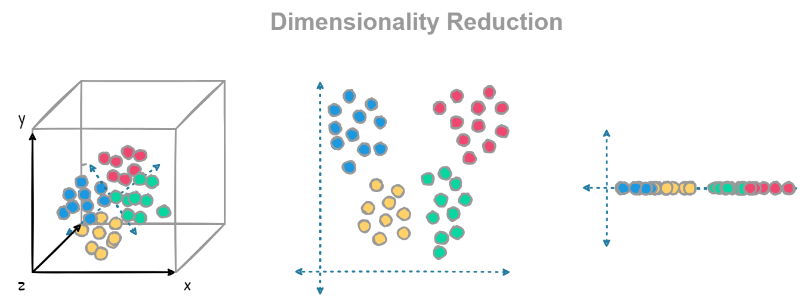
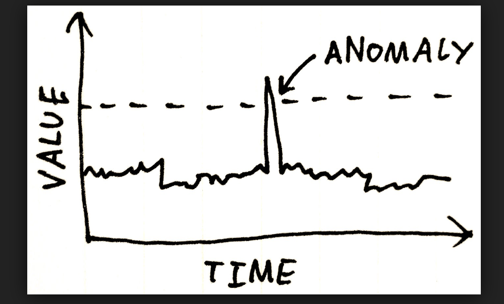
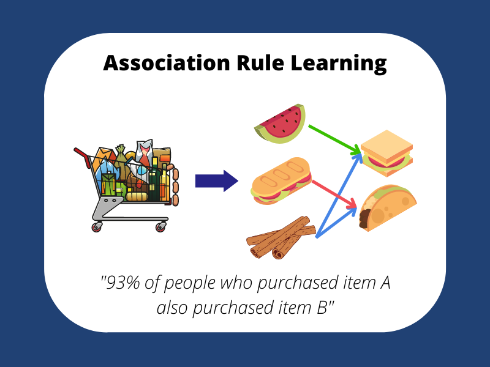
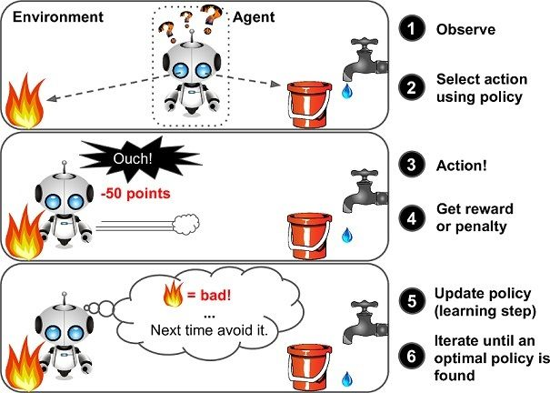

## Types of ML
1. Supervised Learning
2. Unsupervised Learning
3. SemiSupervised Learning
4. Reinforcement Learning

### 1. Supervised Learning
**Definition:** Dataset in which both the input and output are given, and we have to just understand the relationship between input and output.

```
iq | cgpa | placement
87 | 7.1  | Y
111| 8.8  | Y
75 | 6.3  | N
...5000 rows
```
on this data, we observe relation between {iq cgpa} and {placement}, then after getting new data like {79, 8.4}, would he get placed or not.

**Data** - {Numerical, Categorical}
- Regression (output/target column is **numerical**)
  - eg: house price prediction, dog count identification
- Classification (output/target column is **categorical**)
  - weather prediction, dog identification


### 2. Unsupervised Learning
* **Definition:** Dataset in which **only the input features are given and no output (target) column is available**. Since the correct answers are unknown, the model **cannot learn a mapping from input to output**. 
* Instead, it tries to **discover hidden patterns, relationships, structures, or groups** present in the data.

```
iq | cgpa
87 | 7.1
111| 8.8
75 | 6.3
...5000 rows
```

Here, we do not know whether a student got placed or not. The algorithm itself analyzes the data and may discover groups such as:

* High IQ & High CGPA students
* Average IQ & Average CGPA students
* Low IQ & Low CGPA students

The model is not predicting anything because there is no **target column**. Instead, it is **finding patterns** in the data.

### Types of Unsupervised Learning
1. Clustering
2. Dimensionality Reduction
3. Anomaly Detection
4. Association Rule Learning

### 1. Clustering
**Definition:** Grouping similar data points into clusters based on their similarities.



**Example:**
* Customer Segmentation
* Student Performance Grouping
* News Article Grouping
* Friend Recommendation Systems

### 2. Dimensionality Reduction
**Definition:** Reducing the number of input features while preserving as much important information as possible.

**Why?**
* Faster training
* Less storage
* Removes redundant information
* Helps visualize high-dimensional data



**Example:**
Original Dataset

```
Age | Income | IQ | CGPA | Attendance | Projects
```

↓

Reduced Dataset

```
PC1 | PC2
```

Now we can visualize the data in just **2 dimensions** instead of 6.


### 3. Anomaly Detection
**Definition:** Identifying data points that are significantly different from the majority of the data (outliers).



**Examples:**
* Credit Card Fraud Detection
* Network Intrusion Detection
* Machine Fault Detection
* Fake Transaction Detection

Most transactions are normal, while fraudulent transactions appear as anomalies.


### 4. Association Rule Learning
**Definition:** Finding relationships or rules between items that frequently occur together in a dataset.

It answers questions like:
> "If a customer buys X, what else is the customer likely to buy?"



**Examples:**

* Market Basket Analysis
* Product Recommendation Systems
* Amazon "Frequently Bought Together"
* Netflix/Movie Recommendations
* [Beer with Diaper in US Wallmart](https://medium.com/@shwetabhoyar04/beer-and-diapers-the-impossible-correlation-901e3522d50e)

Example Rule:

```
{Bread, Butter} → {Jam}
```

Meaning:
Customers who buy **Bread and Butter** are also likely to buy **Jam**.


### 3. SemiSupervised Learning
**Definition:** Creating labels is very difficult and costly, hence this idea of labelling some of the fields came into picture.

Example:
* Labelling one picture in google photos and rest of them came in the same category


### 4. Reinforcement Learning
**Definition:** No data available initially. 



