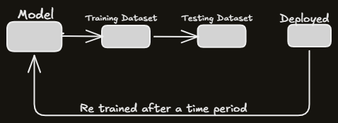

## Batch(Offline) ML vs Online ML
Just like any software, when we code and deploy on any production level, same is used in machine learning models are deployed too on online servers for public use.

## Batch/Offline ML
- Conventional method of training a ML model where complete training data is used for model training.
- Large datasets are trained on an offline system like our system, test it and then it is deployed on the server.

#### **Pros:**
- The model is `static`(not learning on new movies recommendation in netflix example)
- **Periodic Updation** of model is required.
- Lots of Data(in previous data)
- Hardware Limitation

## Online Learning
Ingests data sequentially point-by-point or in mini-batches.

* **Updates:** Continuous and dynamic on the fly after deployment.
* **Resources:** Low memory footprint; data can be discarded post-learning.
* **Best for:** Rapidly shifting data streams (e.g., stock markets, real-time recommendations).

### Ques. How to Implement?
1. Using `scikit-learn` specific libraries.
e.g.,: `partial_fit(X,y)` in SGDRegressor() in LinearRegression

2. Using some dedicated libraries like `River` or `Vowpal Wabbit`.

### Learning Rate
Frequency of model learning with new data like we neither need data to learn too fast to forget previous data or we nor need model to learn at very slow speed to miss new core from the upcoming data(like demonitization happened, and on a news feed app, the news comes 24 hours later because learning rate was 24 hours but the demonitization news is very unuseful after 24 hours as it was useful 24 hours ago).

#### Pros:
1. Tricky to use
2. Risky