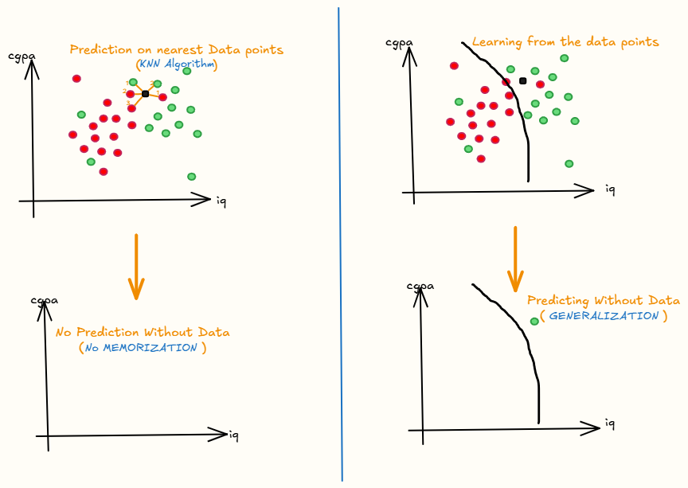
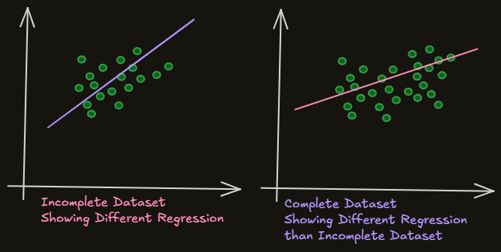

## Learning of ML model

```
Learning
|
|--- Memorizing
|--- Generalizing
```

* Model that learns with memorizing, it is `Instance Based Learning`
  - Eg: Only few models like KNN, kernal functions, RBF networks, etc...
* Model that learns with Generalizing(Fundamental Patterns) it, is `Model Based Learning`.
  - Eg: Most of the models like Linear Regression, Logistic Regression, Dtree 


* The model learns when the data is given and makes the partition between placed and not_placed.


| Usual/Conventional Machine Learning | Instance Based Learning |
|---|---|
| Prepare the data for model training. | Prepare the data for model training. No difference here. |
| Train model from training data to estimate model parameters i.e. discover patterns. | Do not train model. Pattern discovery postponed until scoring query received. |
| Store the model in suitable form. | There is no model to store. |
| Generalize the rules in form of model, even before scoring instance is seen. | No generalization before scoring. Only generalize for each scoring instance individually as and when seen. |
| Predict for unseen scoring instance using model. | Predict for unseen scoring instance using training data directly. |
| Can throw away input/training data after model training. | Input/training data must be kept since each query uses part or full set of training observations. |
| Requires a known model form. | May not have explicit model form. |
| Storing models generally requires less storage. | Storing training data generally requires more storage. |


# Challenges in Machine Learning
## 1. Data Collection
For now we can get data easily for practice from open sources like kaggle or from the instructors but when we get to the industries, there are two major ways to get data:
* API
* Web Scrapping
Both are tedious task but we'll learn about them later.

## 2. Insufficient Data/ Labelled Data

- Let's say we have two algorithms A & B solving the same problem statement:
- Algorithm A is muchh powerful than B but constraint was their size.
- This is called `Unreasonable effectiveness of Data`.
```
    ⌜ ⌝            ⌜ ⌝
     A               B
    ⌞ ⌟            ⌞ ⌟
     ↡               ↡
  100 rows       1000000 rows
     M1              M2
```


## 3. Non Represtative Data
* Ex: There's t20 cricket world cup in India, and a team surveys only in India about who will win the world cup so there would be biasness for Indian team because of the sampling noise.



## 4. Poor Quality Data
* Data cleaning is done here.

## 5. Irrelevant Features
* `Garbage IN Garbage OUT`
* Eg: Organizing a marathon and inviting certain people whose data are available like `age`, `weight`, `height`, `bmi`,`location`, ...
  - In this example bmi & location are not much relevant to out data analysis of whom to invite.

## 6. Overfitting
* Model performing very good on training dataset but very poor performance on new dataset.

## 7. Underfitting
* Model performing very poor on both training dataset and on new dataset.

## 8. Software Integration
* Just model training is not enough, it has to be integrated with multiple software so that end users could directly use it. 

## 9. Offline Learning/ Deployment
## 10. Cost Involved